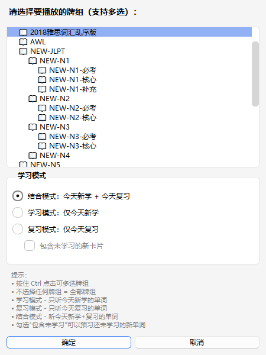
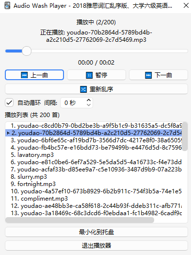
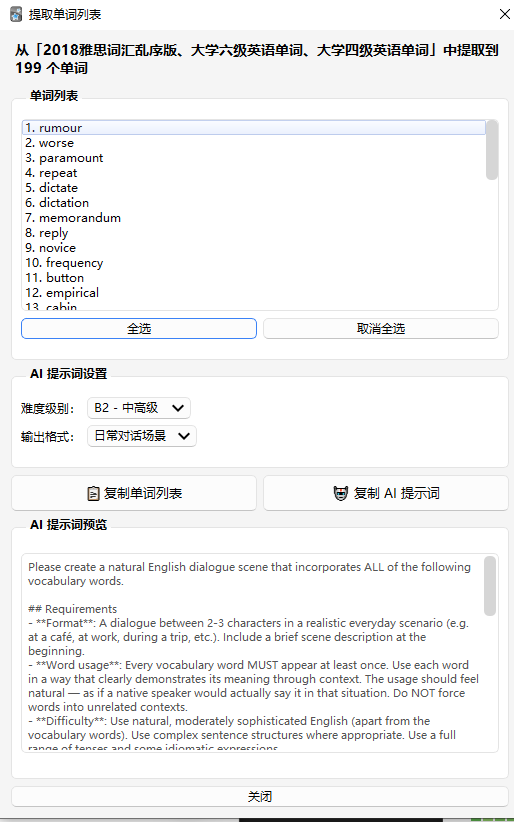
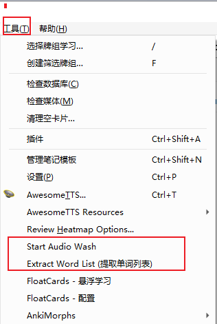

## 

最近我给自己的 Anki 学习流程做了一个小插件，名字叫 **Audio Wash Player**。

项目地址：[https://github.com/evepupil/anki-AudioWash](https://github.com/evepupil/anki-AudioWash)
一开始，它只是想解决一个很具体的问题：很多单词和句子在 Anki 里“背过了”，但离真正熟悉还差很远，尤其是听力输入和语境阅读这两块，总觉得不够自然，也不够连续。

后来我们把这个插件慢慢做成了两个核心方向：

1. **洗脑音频听力**
2. **AI 生文阅读**

它不再只是一个单纯的播放工具，而是把卡片内容进一步转成“可反复听”和“可展开读”的学习材料。

### **为什么会做这个插件**

用 Anki 学语言时，卡片复习当然很重要，但实际体验里通常还有两个空档：

- 第一，复习结束之后，缺少一个低成本的“继续接触”方式。
- 第二，单词本身很碎，离真实语境还隔着一步。

比如说，你今天在 Anki 里学了几十个词，也复习了一批旧卡。做卡片的时候你是认识的，但过一会儿再听到这些词，或者把它们放进一段真实的对话和文章里，未必还能立刻反应过来。

所以我们想做的不是替代 Anki，而是补上这两个环节：

- 用音频循环，把“今天学过的内容”继续灌进耳朵里。
- 用 AI 生文，把“今天抽出来的词”重新组织成可以阅读的内容。

### **功能一：洗脑音频听力**

这个功能的核心思路很简单：
把你今天真正学过、复习过的卡片音频提取出来，然后交给插件去后台循环播放。

在实现上，我做了几件事：

- 支持从 Anki 里查询当天学习和复习过的卡片。
- 支持按牌组选取内容，也可以直接全牌组运行。
- 自动解析卡片中的 [sound:...] 标签，把音频文件提取出来。
- 支持乱序播放、循环播放、间隔控制。
- 支持独立播放窗口和托盘后台播放。

这意味着你可以在这些场景里继续复习：

- 通勤路上
- 散步或运动时
- 做家务时
- 不方便盯着屏幕的时候

相比再次打开 Anki 一张张看卡，这种方式更轻，也更接近日常输入。
它不是让你“正式学习”，而是让你在正式学习之后，继续用更低门槛的方式重复接触当天内容。

我们还把卡片筛选做得比较贴近真实使用习惯。插件里可以选择：

- 只听今天新学的内容
- 只听今天复习过的内容
- 把今天的新学和复习内容混合起来听
- 在部分模式下加入还没正式学到的新卡，做一点预习

这样一来，它不只是“播放音频”，而是能围绕你当天的学习任务来组织输入内容。

### **功能二：AI 生文阅读**

第二个功能，是我们这次觉得很实用的一点。

很多时候，背单词最大的难点不是“这个词我见过没”，而是“这个词什么时候会这样用”。
单看卡片，信息是够精炼的，但语境还是不够多。所以我们又做了一条链路：**从卡片提取单词，再把这些单词交给 AI 去生成阅读材料。**

插件会先从你选中的卡片里提取单词，整理成词表，然后在窗口里提供一组可以直接复制的 AI 提示词。用户可以进一步选择：

- 输出难度等级
- 输出形式

目前支持的生成方向主要包括：

- 对话场景
- 短篇故事
- 例句列表

也就是说，插件并不是直接在 Anki 里调用大模型生成文章，而是先把“适合生成内容的 Prompt”准备好。你复制过去之后，就可以直接让 ChatGPT、Claude 之类的工具生成一篇围绕这些词展开的文本。

这一步非常适合做什么？

- 把一组零散单词变成一段完整对话
- 把当天词汇组织成短文，练阅读理解
- 让同一批词在多个句子里重复出现，帮助形成语感

我觉得这个功能最有价值的地方在于，它把 Anki 的“词条式学习”往前推了一步。
以前是背单词，现在是能把这些词重新放回语境里，再看一遍、再读一遍、再理解一遍。

### **我们希望它怎么被使用**

这个插件比较适合放在完整学习流程的中间和后面，而不是代替主流程。

安装

项目地址：[evepupil/anki-AudioWash: Audio Wash Player 是一个 Anki 插件，可以自动提取今天学习和复习的卡片中的音频，并在后台循环播放](https://github.com/evepupil/anki-AudioWash)

下载项目内容后，放到：C:\Users\<你的用户名>\AppData\Roaming\Anki2\addons21\anki-AudioWash 目录

一个比较自然的使用方式是：

先在 Anki 里完成正常的学习和复习，然后：

- 打开音频模式，让今天的内容在后台循环播放
- 再提取当天词表，生成一段 AI 对话或短文
- 晚些时候拿这段内容做补充阅读

这样其实就形成了一个很顺的闭环：

**卡片记忆 -> 音频重复输入 -> AI 语境扩展 -> 再次接触词汇**

它解决的不是“如何替代背卡”，而是“背完卡之后怎么继续巩固”。

工具入口在：

### **结语**

对我来说，**Audio Wash Player** 不是一个“大而全”的插件，而是一个很具体、很实用的学习增强工具。

它一头连着 Anki 里已经存在的卡片，另一头连着更贴近日常的输入方式：
一边是洗脑音频听力，一边是 AI 生文阅读。

如果你本来就有用 Anki 背单词、背短语、背句子的习惯，这个插件会比较适合你。
它能让你在背卡之外，多出一层持续输入，也让原本零散的卡片内容，慢慢长成更完整的语言材料。

